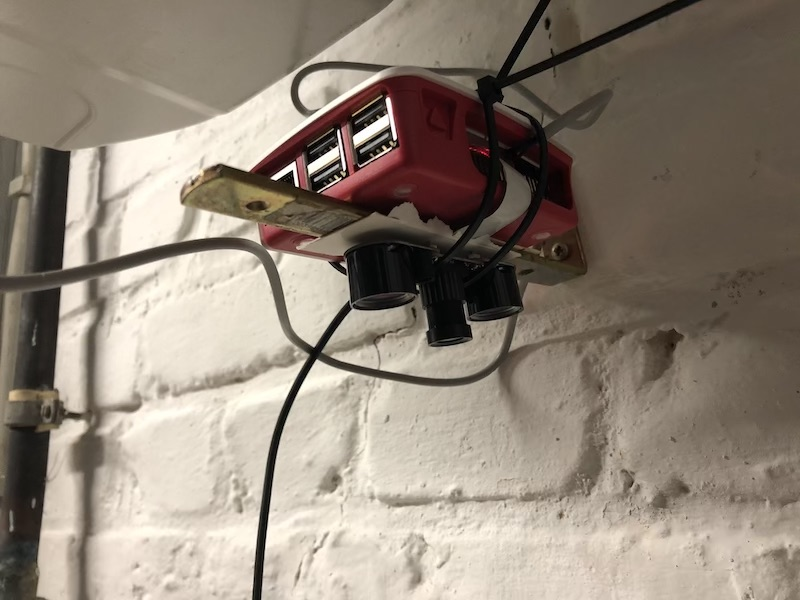
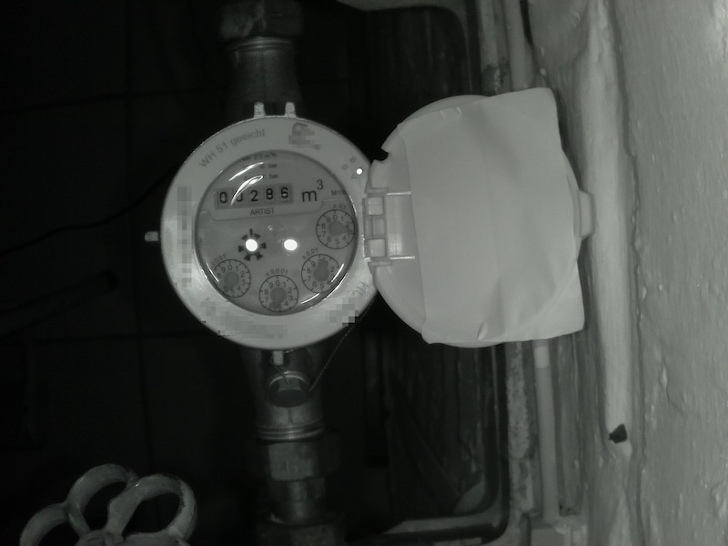
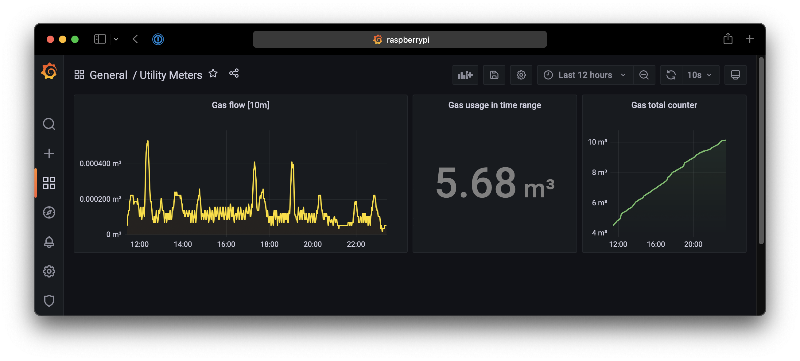

# Self-made Smart Utility Meter
This project aims to gather actual usage data for my house regarding natural gas, electricity and water.

## Motivation
I posed some questions I would like to answer by continuously monitoring my utility meters:
 - Where does all my high water usage come from? Is it because of my long showers or lays the reason in the garden watering during summer?
 - How does different heating strategies affect gas usage?

## Hardware setup

### Gas meter

I started with this one, since I own a "Pipersberg G4 RF1 c" meter, which is so far the easiest to read out compared to my other meters. The vendor prepared the device to be read out by some proprietary addon you can buy for lots of money.

The physics behind it: At a specific spot behind the cover is some rotating piece of metal. Each rotation refers to 0.01m³ gas usage.

I stumbled upon [Rutg3er's blog](https://rutg3r.com/watermeter-reading-with-inductive-proximity-sensor/), who did the same for his water meter. Like he stated, the  inductive proximity sensor is specified for operation between 6-36V, but it works with the 5V the Raspberry Pi can deliver for me as well.

The hardest part is the actual MacGyver-like mounting of the sensor. There is absolute no tolerance for the placement - minimum movements will cause the sensor to detect no events anymore. I'm curious how stable this works in the long run. Maybe I'll add a logic to my counter script, which will notify me when no events are detected for a certain time and the sensor may have fallen down.

### Water meter

This is going to be tough one. Since the meter does not provide any interface, a completely optical approach is needed. So I installed an infrared camera above the meter, so it can also capture images when the light is off.

The camera works quite well. However, I just entered the image recognition hell. Besides the reflections, just reading the numbers only gives me coarse-grained information in m³.

`Work in progress`

## Software setup

A small Python script is provided which starts an HTTP server which is responsible to return all counters as Prometheus metrics. Prometheus will scrape this endpoint regularly and store the metrics as time series. Visualization can then be done using Grafana.

### CI/CD
GitHub actions are used to deploy to the RaspberryPi. Using the Runner which is installed on it no incoming connections from the internet needs to be allowed for that. Since the Python script is running as a systemd process it can't be restarted by GitHub due to lack of privileges. Instead, a second service watches for changes in the given path like described on [StackExchange](https://superuser.com/questions/1171751/restart-systemd-service-automatically-whenever-a-directory-changes-any-file-ins/1276457).

