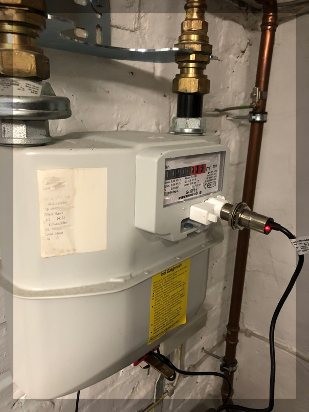

# Self-made Smart Meter

This project aims to gather actual usage data for my house regarding natural gas, electricity and water.

I hope to to answer some questions using Data Analytics afterwards:
 - Where does all my high water usage come from? Is it because of my long showers or lays the reason in the garden watering during summer?
 - How does different heating strategies affect gas usage?

## Gas Meter

I started with this one, since I own a "Pipersberg G4 RF1 c" meter, which is so far the easiest to read out compared to my other meters. The vendor prepared the device to be read out by some proprietary addon you can buy for lots of money.

The physics behind it: At a specific spot behind the cover is some rotating piece of metal. Each rotation refers to 0.01 cubic meters gas usage.

I stumbled upon [Rutg3er's blog](https://rutg3r.com/watermeter-reading-with-inductive-proximity-sensor/), who did the same for his water meter. Like he stated, the  inductive proximity sensor is specified for operation between 6-36V, but it works with the 5V the Raspberry Pi can deliver for me as well.

The hardest part is the actual MacGyver-like mounting of the sensor. There is absolute no tolerance for the placement - minimum movements will cause the sensor to detect no events anymore. I'm curious how stable this works in the long run. Maybe I'll add a logic to my counter script, which will notify me when no events are detected for a certain time and the sensor may have fallen down.

## Water Meter

## Electricity Meter

